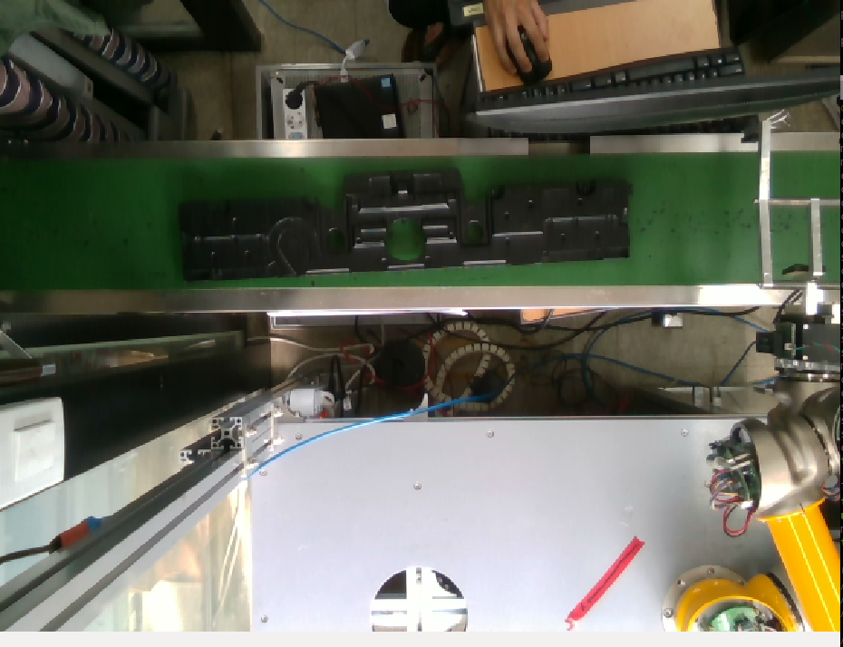
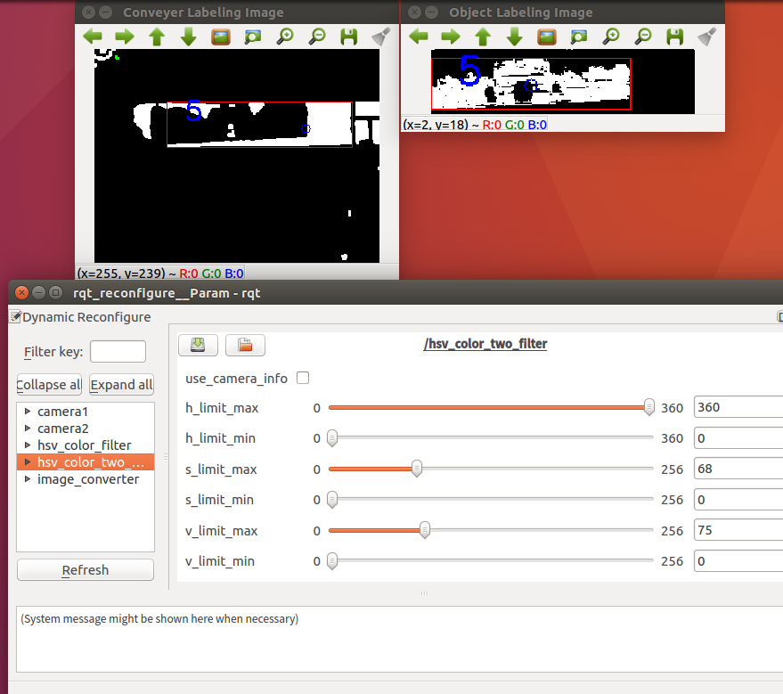

# opencv-ros

Image processing using OpenCV for Labeling and HSV, Filtering on the ROS.

__Goal__: extraction of object(e.g., enclosure) position from the raw image on the ROS(kinetic) -Ubuntu(16.04) environment.

After the hsv convesion and filtering and labeling, I extracted the ROI for detecting the object(black color) using OpenCV3.
On the ROI area, I did again the hsv convesion for extracing the black color. 
As a result, I can extract the center of x, y about detected object.

## Raw Image

## Extracted Image

<pre><code>roslaunch opencv_pkg conveyer_object_detection.launch  </code></pre>

