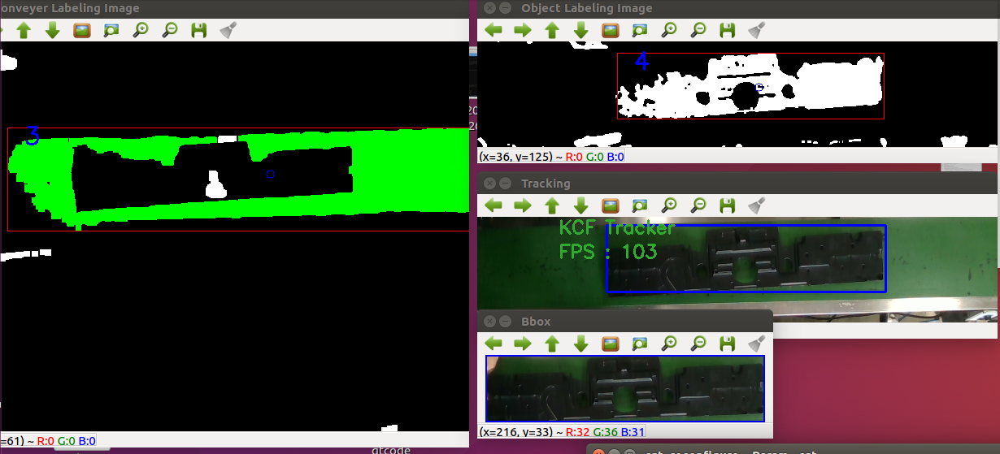

# opencv-ros

Image processing using OpenCV for Labeling and HSV, Filtering on the ROS.

__Goal__: extraction of object(e.g., enclosure) position from the raw image on the ROS(kinetic) -Ubuntu(16.04) environment.

After the hsv convesion and filtering and labeling, I extracted the ROI for detecting the object(black color) using OpenCV3.
On the ROI area, I did again the hsv convesion for extracing the black color. 
As a result, I can extract the center of x, y about detected object.

## Raw Image


## Extracted Image(HSV and Labaled img)


## Tracking Image

To obtain the center position of desired object, I adjusted the Kalman filter tracking algorithm. 
The process is based on the labeling and hsv, and Kalman filter tracking works including various conditions such as maximum labeling size, minimum labeling size.

<pre><code> roslaunch opencv_pkg conveyer_object_detection.launch --screen </code></pre>




-------


## How to play the rosbag file

Download the bad files on the Google drive for NSCL account.

After roscore or roslaunch,

```
rosbag play ($bag_file_name) 
```

you can check using rqt.
